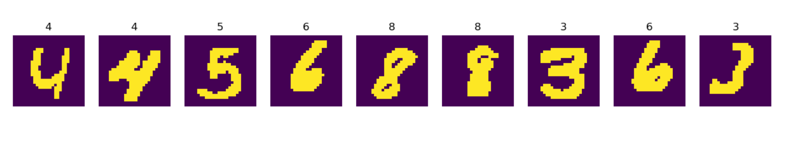

## 將圖片製作成記憶體物件資料集
> 將數字1~9的圖片做成資料集，並且輸入到tensorflow的靜態圖中，然後在將資料從靜態圖中輸出，並顯示。

在讀取資料時，建議不要一次讀取所有資料，建議使用queue方式讀取，可以使用兩個執行緒去處理，一個從queue取出資料，另一個用於讀取檔案並放入快取，如下圖所示:

### 產生queue中的批次資料
1. tf.train.slice_input_producer產生queue
2. 將queue裡的圖片進行處理
3. tf.train.batch將處理後的圖片做成批次數據

### 輸出結果
